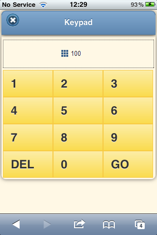
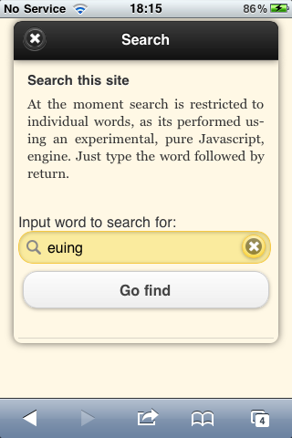
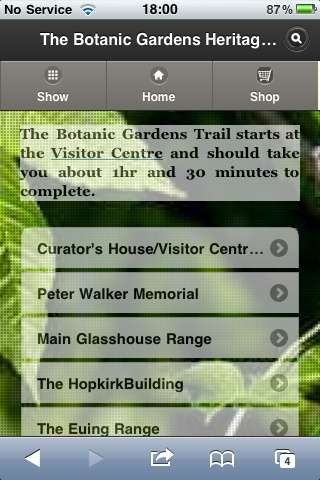
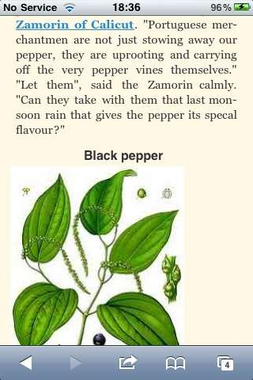

index: 203

# Cilogi Technology

Cilogi provides a platform for the creation and delivery of mobile
guides to museums, galleries, gardens and other collections. 

We provide an efficient way for collections to provide first class
information to visitors, and to earn a significant income via an
integrated shop.

A sample guide (not complete but showing all features can be found
[here](http://goo.gl/V8ZX3). This guide is _not_ offline.

The principal features of our platform are:

1. Guides are web applications containing text, images, audio and
   video, running on high-end mobile phones;
   
2. Visitors access guides by capturing a QR code on camera or entering
   a short URL by keyboard. Browsing starts immediately at any point
   in the guide. You don't have to go through a gateway, or download
   an application;
     
     
     
2. A short numeric code can be entered with an on-screen keypad to get
   information about an specific which has a physical label with
   the code;
     
     
     
3. Guides contain an integrated shop which provides offers
   for individual exhibits, and immediate in-guide purchasing;
   
3. Guides provide detailed analytics about their use, so you can see
   what what visitors do, and what they are interested in.
   
4. Guides run offline, without an Internet connection.  They work
   inside buildings when you are out of 3G and WiFi range.
   
5. Guides are fully integrated with Wikipedia and other public
   information sources. This lets you both enrich the information
   provided to visitors and enables collaborative engagement with the
   visitor community.
   
6. Guides are created using a simple file-based
   content management system (CMS). You can create a guide just by
   entering text in your preferred editor and dropping images into a
   directory on your computer; 
   
6. Guides are free -- Cilogi does not charge for creation or delivery.
   We can do this because our platform is efficient and because we
   take a small fee from items sold in the shop.

Let's look at these features in more detail.

## Guides as Web Applications

A variety of mobile guides to Museums and other collections have been
produced. These have exclusively been developed as _apps_, mainly for
the iPhone. 

Our guides are HTML5 mobile websites (sometimes called web apps).
There are several reasons for choosing websites over apps.

* Websites are part of the web.  You can access any page of
  a website via a public URL.  This lets you jump right into a guide
  at any page.
* Websites cover a wider range of devices whereas apps are for a
  single platform.  Mobile apps which run multi-platform are usually
  just a wrapper round a website (see PhoneGap for example).
* It is possible to make payments from mobile websites without having
  to pay Apple a tax of 30%.
  
The two main advantages of apps are that developers can easily get
paid for them, and that in an app you have access to phone capabilities,
such as the camera, that you don't from the web browser.  Neither of
these apply to our guides as they are free, and we don't need access
to phone capabilities.

## Discovery via QR codes and URLs

How do you get to find out about a guide?  Our solution is to provide
[QR codes](/wiki.html?target=QR_code) and
[short code URLs](/wiki.html?target=URL_shortener)
throughout the collection.  A QR code leads to the guide when you take
a picture of it with the phone's camera; a short code URL can be typed
in with little effort. 

These codes can be placed on exhibits, wherever there is space.  In a
garden for example we may place a QR code on small label on a
tree. The web page to which this leads will describe the tree (or
other exhibit), and from this page the whole guide is available, as
shown in the image below, which is from
[this page](http://xstatic.s3-website-eu-west-1.amazonaws.com/tim@timniblett.net/botanics/contents/trail/weeping-ash.html). 

A page linked in this way provides a seamless and elegant means of
entering a guide, even for visitors who may not have intended using
the guide in the first instance.

## Keypad to navigate directly to exhibits

Once the guide has been launched simple numeric codes can be used to
move directly to pages for individual exhibits.  All that is required
is for the number to be placed with the exhibit.

   
The advantage of a small code is that is can be placed discreetly with
small exhibits, so that items in a crowded display case can be
individually located and examined.  For many collections this is a
significant issue as display cases contain many exhibits and there is
simple not room to provide adequate signage for all of them.

## An integrated shop

You are most likely to buy something when you're looking at an
exhibit, your enthusiasm is sparked, and you'd like to follow this up,
usually by buying something. Our guides let you do this by saying
which item(s) is(are) likely to be of interest for any exhibit. In a
gallery this might be a framed print of the picture you're looking at,
or a book about the artist who painted the picture.  In a garden it
may be the opportunity to buy a cutting, or seeds for, a particular
plant.

Purchases are made via PayPal.  Other mobile-capable gateways will be
introduced over time.  The critical features of a payment method are
that (a) you don't need to worry about security, (b) you don't
have to input more than the minimum of personal details (email and
password), and (c) you're already signed up to it.

You set up a store by providing a comma separated file, which is
parsed, converted to [JSON](/wiki.html?target=JSON) and
loaded (asynchronously) when any page of the website is loaded.  The
comma separated file can easily be output from a database.

In order to take advantage of the link between exhibits and items in
the shop you either have to extend your database to include this
information or provide a structured text file which specifies this
linkage.

Our guides work offline.  This inevitably limits the amount of data
which can be stored for any shop. An offline shop should not contain
more than 250 items.  If you need more then online mode should be used
(see our discussion below).

When you're offline you can't buy anything, as an Internet connection
is required to charge a credit card.  You can fill your shopping cart
while offline, but if you try to pay you'll get a message telling you
you're offline and offering to provide a reminder as soon as you get
online again.  This reminder can only be sent when the guide is being
displayed. This limitation is inevitable and means that you should
make sure that there is either 3G or WiFi coverage at the entrances
and exits to the collection, if not throughout.

## Web analytics with Guides

Web analytics are in widespread use for desktop web sites.  Analytics
for mobile guides are even more powerful as information is available
about the route visitors take through the collection via the order of
pages visited.  Analytics can be used to optimise the information
provided in the guide and to track and optimise the performance of the
shop. 

Standard analytics packages such as Google Analytics has a 
problem when used with guides -- you don't get information when
you're offline.

We are actively looking at solutions to this issue. As with shopping
the best solution is store tracking information when offline and send
it when online again. We are looking at ways of doing this with Google
analytics. 

We have location information from visitors by assuming location from
short URL and QR code inputs, together with keypad inputs.  The
mapping feature of our guides
[e.g see here](http://xstatic.s3-website-eu-west-1.amazonaws.com/tim@timniblett.net/botanics/diagrams/botanics.html)
provides location.  It may prove useful for Cilogi to provide its own
Analytic information, or to process third party information such as
from Google Analytics to allow collections to examine vistors' paths
through the collection.

## Offline guides

In many collections 3G is not available -- building can be problematic
-- and WiFi has not been installed.  In these circumstances it is more
difficult to provide a mobile guide.

Our guides can be available offline.
[Offline caching](http://www.w3.org/TR/html5/offline.html) of
applications is an HTML5 feature which Cilogi implements as an option
for each guide.

Of course, an offline guide has to be downloaded at some point. The
simplest way to enable this is to provide WiFi at the entrance to the
collection, or to make sure that WiFi and/or 3G is available
throughout the collection, if not everywhere.  Its tactful to _not_
place QR codes and short URLs in places where there is no connection!

The current state of mobile browsers means that offline sites cannot
be larger that 5 or 10MB on the major platforms.  This is not enough
for many Cilogi guides.  We therefore use
[WebSQL](http://www.w3.org/TR/webdatabase/) to extend this to 50MB or
more.  WebSQL is due to be superseded, at which point we will need to
look for another solution.

Offline web sited require a radical change in architecture. Cilogi has
such an architecture. Our architecture is client-centric.  The flow of
control between pages occurs on the mobile phone and services are
requested from central servers as required. No service is essential,
guaranteeing that visitors have an excellent experience when offline.

When offline, pages must be stored or generated on the client. A
pre-compiled static page is usually sufficient.  When it is not (for
example to generate dynamic views of an online store) a database,
templates and control code must be present on the client.  

Our compilation process sets up all these when the website is
generated.  Databases are stored as JSON with query access via canned
JavaScript code. The JSON is usually embedded into JavaScript files,
and thereby loaded when the website is first accessed.

For the guides to work offline its essential that all the code is
loaded with the first page.  For a medium-sized site with full text
search the volume of code will be less than 500KB.

Our guides function as single page websites, and aggressive caching is
used (unique file names and far future expiry) so that this hit only
happens on initial load.

Three examples of the architectural implications of offline websites
as guides:

### Templating and databases

Shopping pages are traditionally generated by using a database, containing
information about the items available, offers, etc. and a set of
templates which are filled in using information from the database.

Cilogi generates shopping pages in much the same way except that the
templates are client-side (using jQuery Templates) and the database is
converted at compile time into a JSON file which is loaded on startup
as part of the code base. 
  
### Search

Cilogi provides a simple full text search facility.  As with the database
it is possible to generate an inverted index at compile time and we do
this. However, we also allow additional pages from Wikipedia and other
sources to be added at runtime, so a hybrid strategy is used for
search, with additional pages being processed on-the-fly in JavaScript.

### Tours

A tour is an ordered sequence of stops, each stop of which is an
exhibit or feature of the collection.  Cilogi supports tours in two
ways. 

1. A tour is _compiled_ when the guide is generated.  Compilation
   involves getting the tour definition, basically a list of exhibits,
   from a database or structured text file, creating an overview page
   for the tour and inserting links into page of the tour.
2. The tour specification is downloaded when the guide is accessed.
   The overview page is generated on the fly using a template, and the
   individual tour pages are modified on the fly to add the necessary
   links. 
  
Which of these approaches is best depends on whether a single page
can be part of more than one tour. If so, then the second approach is
mandated. Otherwise the first is simpler.

A couple of points should be made about each approach.  In the
compilation approach links are inserted directly into the HTML
document, using the [Jsoup](http://jsoup.org/) HTML5 parser. This is
significant as it means that tours operate as a _module_.  A tour can
be added simply by adding its specification.  You don't have to htink
about how this feature will interact with others.

The on-the-fly approach depends on (a) use of persistent storage -- we
use [HTML local storage](http://dev.w3.org/html5/webstorage/) and (b)
the ability to intercept and modify pages before they are displayed.
This latter ability is provided by the
[jQuery Mobile](/wiki.html?target=JQuery_Mobile) framework,
which is the web framework we use.  jQuery Mobile provides first class
support for iOS, Android and Blackberry 6.

## Integration with Wikipedia and Wikitravel

No-one has the resources to provide comprehensive information relating
to all the exhibits in a collection. For instance a gallery may have a
work by
[Alberto Giacometti](/wiki.html?target=Alberto_Giacometti)
on display. As a visitor I may be interested in looking at other work,
outside the collection, by this artist and then following up on these
artists. Its just not possible to provide all this information as a
single organisation.

Linking to Wikipedia provides the ability to explore more widely from
a given starting point.

Wikipedia (and WikiTravel) content can be incorporated in three ways
into Cilogi guides:

* A link to Wikipedia can be included in text;
* The
  [transclusion](/wiki.html?target=Wikipedia:Transclusion)
  of a Wikipedia article can be included on a page; 
  
  
  
* A page can just _be_ a Wikipedia page.

In each of these three cases the Wikipedia content is available
offline and is a fully integrated part of the guide.  In addition any
Wikipedia pages visited via links are available offline and are
indexed by our full text search capability.

## File-based content management system

Authors can generate guides just by editing text files, and by
dropping images into the appropriate directory. Work can be shared, so
that multiple authors can work  on a guide simultaneously.

Pages are written in [Markdown](/wiki.html?target=Markdown), a simple markup
language which allows pages to be created with a simple text editor.
Here is an example:
    
    # Title
    
    Markdown is structured text, like Wiki syntax 
    but simpler.
    
    * Lists are easy
    * just use an asterisk
    * Links [like this](/wiki.html?target=Link]
    
    
    

Authors work on a local folder attached to
[Dropbox](https://www.dropbox.com/). An author signs up to Cilogi and
receives an invitation to share a Dropbox folder.  Any changes and
edits are automatically shared with Cilogi.  Cilogi monitors the file
system and any changes to a marker file trigger compilation and launch
of the guide.  

Cilogi checkmarks each version of the site (using Git)
and any recent version can be recovered if there is a problem.  A new
version must be approved before it moves from staging, so the author
can check and approve a guide before it is launched to the public.

It is possible to edit guides remotely using the Chrome Web Browser
and the [SourceKit](https://github.com/kenotron/sourcekit) editor.

Collaborative work on articles can be performed on Wikipedia or other
open wikis.  There are also a number of closed wiki tools that can be
used, and which have an API Cilogi can access.  This is the most
appropriate mechanism for public collaboration on guides.

## Free to develop and deliver

It is free to develop guides, and free to deliver them to visitors.
You retain ownership of the content, which sits in a folder on your
computer. 

We are using cloud infrastructure, currently from Amazon with
[S3](/wiki.html?target=Amazon_S3), Google with
[App Engine](/wiki.html?target=App_Engine) and
[Dropbox](/wiki.html?target=Dropbox_(service)).

Using the cloud eliminated fixed infrastructure costs, and to a large
extent the requirement for in-house maintenance.  Costs are
further reduced by minimizing work beyond simple file serving.
Extensive customization of pages, a la Facebook, for each individual
user can be very expensive in computing resources, particularly for
bursty traffic.

Cilogi's architecture is that of a JavaScript(CoffeeScript, Dart, GWT
if you prefer) application on the client with
[REST](/wiki.html?target=Representational_state_transfer)
services provided from Cilogi's infrastructure.

Mobile phones are personal devices so JavaScript-based customization
on a per-user basis works well and provides most of what a
server-based solution can.  Services such as
[Disqus](/wiki.html?target=Disqus), work on mobile websites
and require only JavaScript (and
[JSON](http://en.wikipedia.org/wiki.html?target=JSONP)). If
necessary it is possible to password protect sensitive information via
encryption.

-----

Cilogi currently works on two cloud platforms,
[Amazon S3](/wiki.html?target=Amazon_S3) and
[Google App Engine](/wiki.html?target=App_Engine). Amazon
S3 supports purely static sites, with web services only available via
JSONP.  App Engine provides a scalable full-service platform.

Careful design has been required for App Engine to ensure that costs are
contained.  Static web serving is possible from App Engine for very
little more than the cost of outgoing data.

At present App Engine is used for services, although other platforms
can be used.  An advantage of App Engine is that images, which generate
of about 80% of a site's outgoing bandwidth are served from Google's
very efficient content delivery network (CDN).  With conservative
assumptions the total cost of delivering a complete guide will be about
£0.005 per visitor.

  
